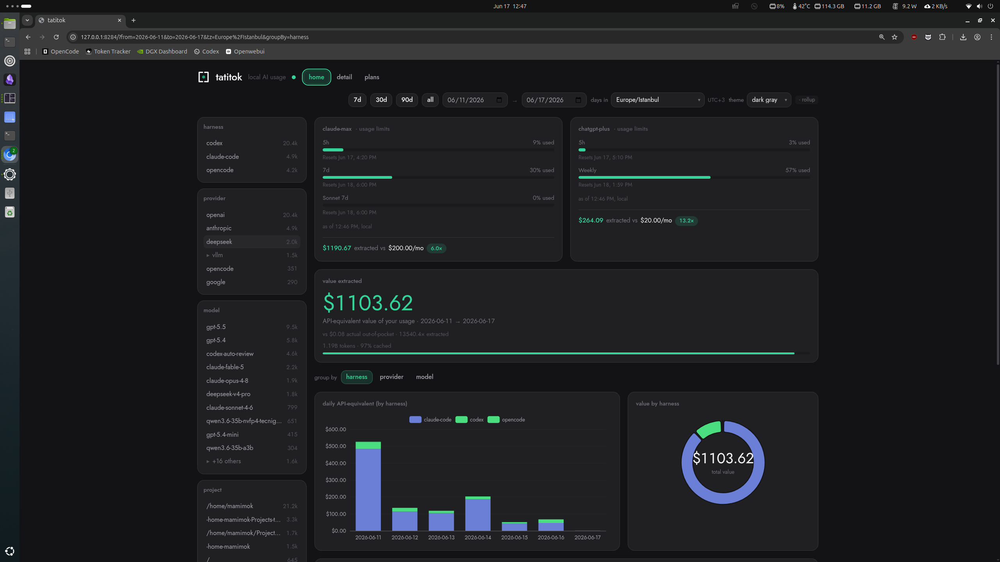
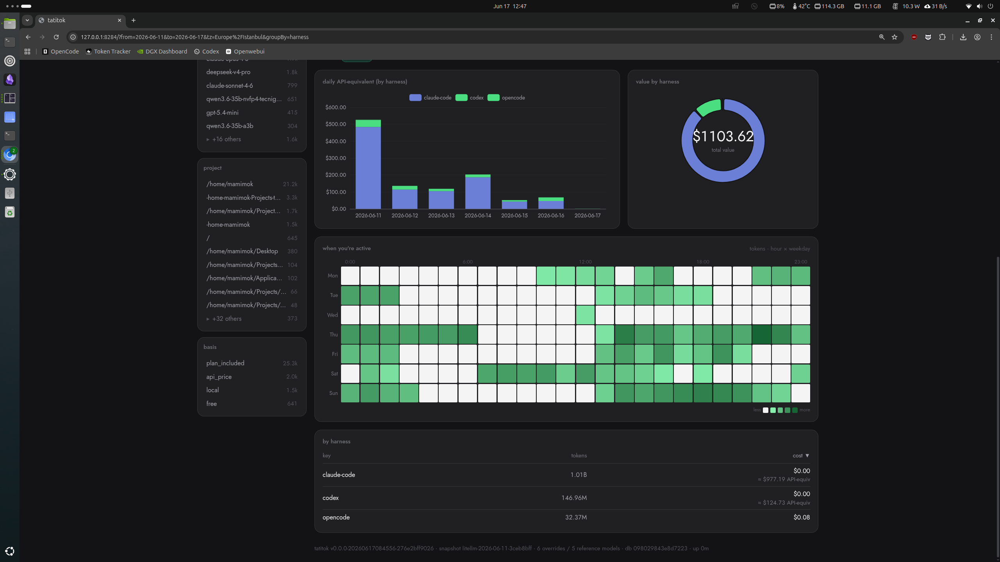
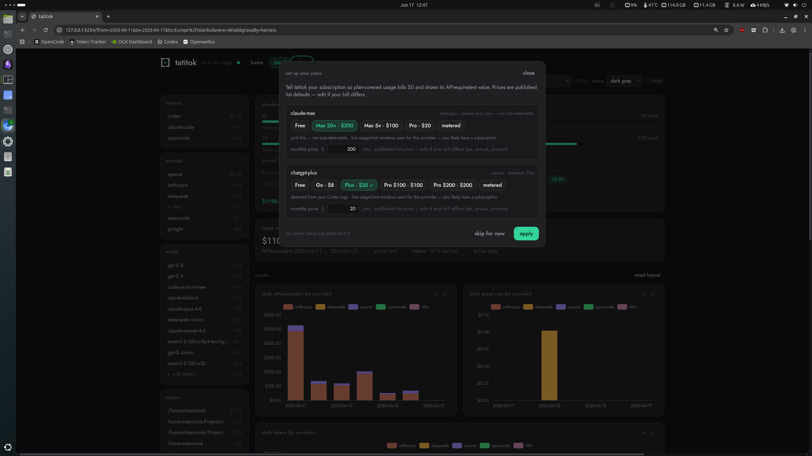
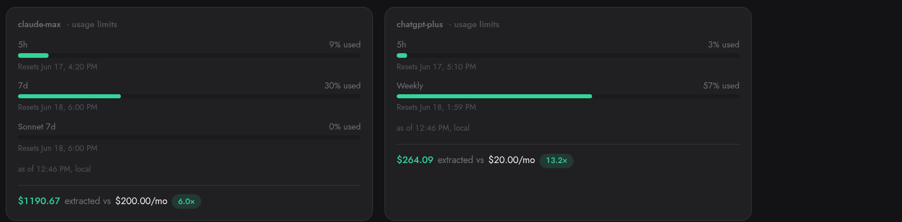
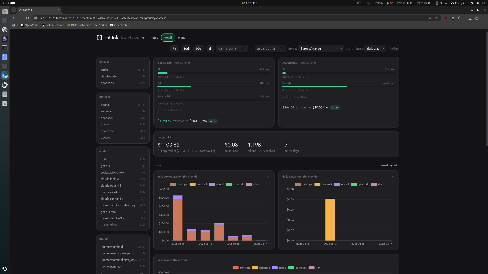
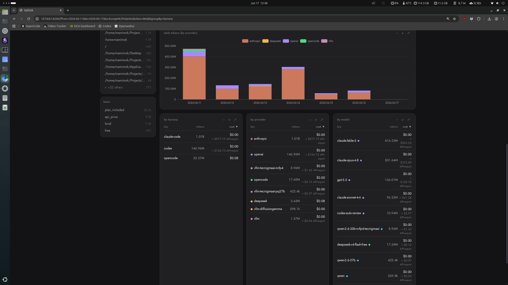
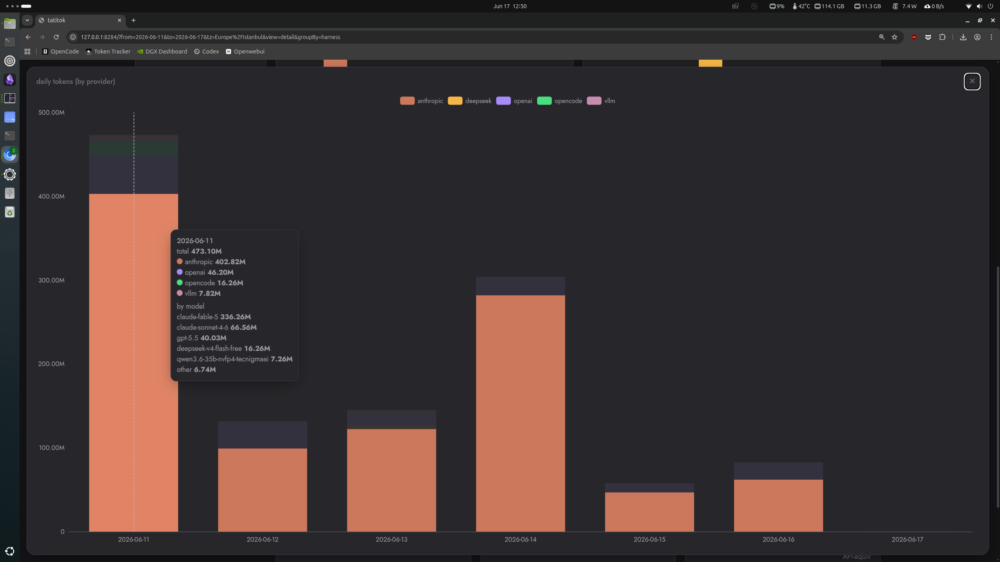
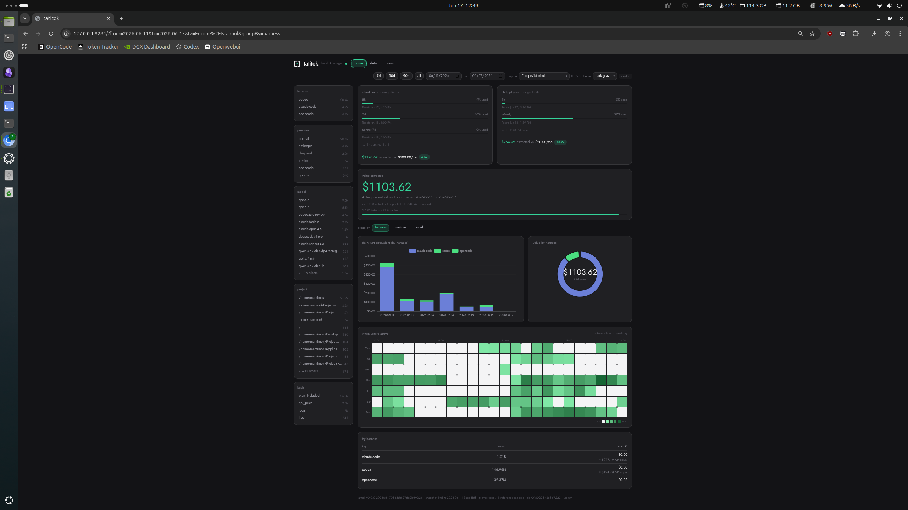
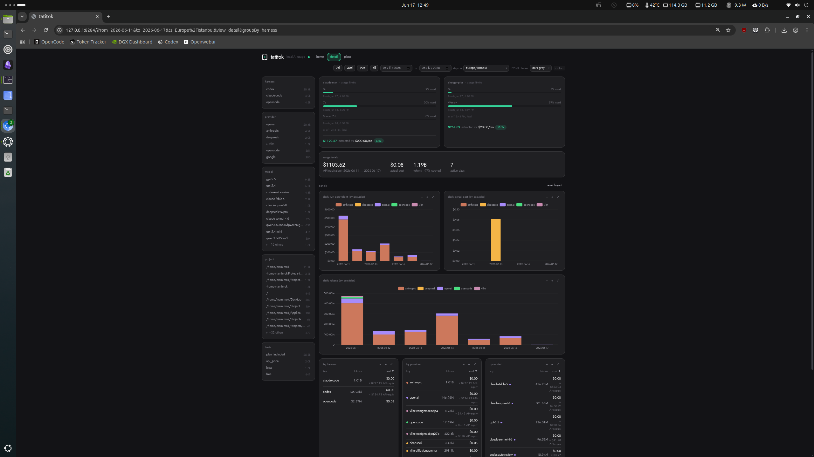

# tatitok

A local-first dashboard that shows the API-equivalent value of your Claude Code, Codex, OpenCode, pi, and Antigravity CLI usage versus what you actually pay — all on your own machine.



*The home view: $1103.62 of usage priced at API rates that actually cost $0.08 out of pocket, with the daily breakdown and value-by-harness split below.*

## What it does

tatitok reads the logs your coding agents already write to disk, prices that usage at each provider's published API rates, and puts two numbers next to each other: what the same tokens would have cost on the metered API, and what you actually pay out of pocket on your subscription.

What makes it different is the honesty stance. Everything runs on loopback (`127.0.0.1`) — nothing ever leaves your machine and there's no telemetry. And it never guesses your subscription: you declare your own plan and prices, because a wrong guess would fake the exact number the tool exists to make honest.

The home view leads with the number you came for, then fills in the texture below it — when you tend to be active, and which harness the value comes from.



*Further down the home page: an activity heatmap by hour and weekday, and value broken out by harness.*

## Quickstart

You'll need **Go 1.25+** and **Node 24** (the repo pins `24.15.0` in `web/.nvmrc`; if you use nvm, `nvm use` in the repo picks it up). The build compiles the Go binary and bundles the dashboard into it. There's no CGO and no database to install — SQLite is embedded.

```sh
git clone https://github.com/harunaltikaya/tatitok.git
cd tatitok
make build            # builds the dashboard + the Go binary into ./dist/tatitok
./dist/tatitok serve  # starts the local hub on 127.0.0.1:8284
```

Then open **http://127.0.0.1:8284** in your browser.

On first run, `serve` scans the agent logs already on your machine and ingests your history automatically — there's no separate import step. Leave it running: it watches for new activity and updates the dashboard live. Stop it with Ctrl-C.

## Onboarding — set up your plans

The first time you open the dashboard with usage present, tatitok pops up a panel titled **"set up your plans."** This is how it learns what you actually pay, so it can show plan-covered usage as $0 out of pocket with its API-equivalent value beside it.



*Codex is detected and pre-filled ("detected: Plus"); Claude can't be, so the panel asks ("choose your plan — not auto-detectable"). Every price is an editable list default.*

There's one card per provider. The flow:

1. **It pre-fills what it can detect.** Your ChatGPT/Codex tier (Plus, Pro, …) is read straight from your Codex logs and shown already selected, marked with a `✓`.

2. **It asks for what it can't.** Your Claude tier — Free, Pro, Max 5×, or Max 20× — isn't recorded in any log, so the Claude card reads *"choose your plan — not auto-detectable"* and waits for you to pick. ChatGPT Pro is half the same story. When Codex logs the plan as `prolite`, that is the $100 tier, and the card shows it detected as **Pro $100**. When the logs say plain `pro`, **Pro $100 and $200** look identical (*"Codex Pro detected — pick $100 or $200"*), so you choose. The third card, **Google AI Pro** (for Antigravity CLI), is always your call too: pick AI Pro or metered.

3. **Prices are pre-filled at published list rates.** Each paid tier shows its monthly price in an editable box. If your real bill differs — tax, annual billing, a promo — just edit it.

4. **Pay per token instead?** Click **metered** on a provider's card. That writes no plan; that harness stays billed at API rates — the right answer if you don't have a subscription there.

5. **Hit "apply."** tatitok reprices your stored usage under the plans you declared. Plan-covered usage now reads $0 out of pocket with its API-equivalent value next to it, and the dashboard refreshes.

You can dismiss the panel with **"skip for now"** and reopen it anytime from the **plans** button in the header.

Each declared plan gets a card on the dashboard with its live usage-limit windows. The Claude and ChatGPT windows come from the [browser extension](#the-browser-extension-optional). The Google AI Pro card shows Antigravity's four windows, fed by the [agy hook](#the-agy-hook-antigravity-cli): Gemini 5h and weekly, and Claude+GPT 5h and weekly (the non-Gemini models inside agy).

Each card is titled with its plan's label, which onboarding fills in from the tier you pick: "Claude Max 5x", "ChatGPT Plus", "Google AI Pro" and so on. Both ChatGPT Pro tiers read "ChatGPT Pro"; the card's monthly price tells them apart. The label is display text only. It's stored as `"label"` on the plan in `~/.config/tatitok/prices.json` (under `$XDG_CONFIG_HOME` if you set it), so you can edit it there to rename a card. Nothing is repriced, so no `recompute` is needed; the hub shows the new title the next time `serve` starts. A plan without a label is titled by its name (`claude-max`, `chatgpt-plus`, `google-ai-pro`).

### Why it asks instead of guessing

This is the whole idea, so it's worth saying plainly. Your Claude subscription tier genuinely is not in any log tatitok can read (the API's `service_tier` field is a serving class, not your plan), and when the Codex logs say plain `pro`, ChatGPT Pro $100 and Pro $200 are indistinguishable. tatitok *could* guess — but the point of the tool is to tell you a true number, and a guessed plan would silently fake the one figure you came here to trust. So it detects what's real, asks for what isn't, and shows every price as an editable default. Nothing is invented.

> Prefer the terminal? `tatitok onboard` does the same thing from the CLI: it auto-detects your Codex tier, prompts for the rest, and prints the `tatitok recompute --pricing` step that reprices your stored events. Run `tatitok onboard --help` for the flags.

## The browser extension (optional)

The dashboard's core is built only from numbers your local logs actually contain. Some things aren't in any local file — like your live **usage-limit windows** on Claude and ChatGPT ("X% of your weekly limit used"); only the provider's own web session knows those. The companion extension, in `extension/tatitok-limits/`, fills that gap: it reads those limit numbers from your logged-in claude.ai / chatgpt.com sessions and posts them to your local hub, which renders them as cards on the dashboard.



*The cards the extension feeds: each window's usage, plus how much value you've pulled from the plan against its monthly price (6.0× and 13.2× here).*

The current extension is version 0.6.2. On the Claude card it shows every usage bucket claude.ai reports for your account (such as 5h and 7d), plus the scoped weekly windows from the `limits` list in the same response, such as "Fable 7d". The Claude Code cloud-session credit is one of those buckets and appears as "iguana_necktie (cloud credit)"; the codename stays in the label because claude.ai may rename it. On the ChatGPT card it shows the 5h and weekly windows. After pulling a new version, click the extension's reload button on `chrome://extensions`.

The hub takes provider names and window labels as short plain text only. When the extension (or any other feeder) posts to `POST /api/v1/limits`, each one must be non-blank, at most 64 characters and printable. Anything else is refused with a 400 and the whole post is dropped.

Setup is manual for now — it isn't in the Chrome Web Store yet:

1. Open `chrome://extensions`.
2. Turn on **Developer mode** (top-right toggle).
3. Click **Load unpacked** and select the `extension/tatitok-limits/` folder.
4. The first time it reaches the hub, Chrome shows a **Local Network Access** prompt — allow it, so the extension can talk to `127.0.0.1`.

There's no build step; it's plain unpacked files. If your hub isn't on the default `http://127.0.0.1:8284` (say, `serve --addr 127.0.0.1:9000`), set the **hub URL** in the extension's options (chrome://extensions → Details → Extension options). It accepts only `http://127.0.0.1[:port]` or `http://localhost[:port]`, so the limit numbers never leave your machine. See [`extension/tatitok-limits/README.md`](extension/tatitok-limits/README.md) for details and options.

## The agy hook (Antigravity CLI)

Antigravity CLI (`agy`) keeps no per-call usage on disk, so tatitok ships a small status-line hook for it in `extension/agy-statusline/`. It's plain Python with the standard library only. Install it with:

```sh
python3 extension/agy-statusline/tatitok-agy-statusline.py --install
```

That adds a `statusLine` entry to `~/.gemini/antigravity-cli/settings.json`, backing the file up to `settings.json.pre-tatitok` first. It refuses if you already have a status line configured. agy runs the hook on every status refresh, and your agy status line then reads `tatitok`.

**What it logs.** Whenever a conversation's token totals change, it appends agy's status object to `~/.local/share/tatitok/agy/statusline.jsonl` (under `$XDG_DATA_HOME` if you set it). The object carries metadata such as the model, the session ids, the working directory and the running token totals, with your email removed. No prompts or responses are logged. tatitok turns each increase in those running totals into one usage event. Every 90 seconds the hook also posts agy's four quota windows to your local hub, so the Google AI Pro card's windows only refresh while an agy session is open.

**It stays out of agy's way.** The hook is budgeted to finish within 200 ms, and the post runs in a detached background process. It only talks to a loopback hub: `TATITOK_HUB_URL` can point it at `http://127.0.0.1:<port>` or `http://localhost:<port>`, and any other value is ignored.

To remove it, run the same script with `--uninstall`. It deletes the `statusLine` entry only if it's still the tatitok hook, and it keeps the backup.

## New-model prices (optional)

The pinned price snapshot only knows the models that existed when it was taken, so a model released since then shows up as unpriced. The companion in `extension/litellm-refresh/` fills that gap without a rebuild. It's plain Python with the standard library only. Install it with:

```sh
python3 extension/litellm-refresh/tatitok-litellm-refresh.py --install
```

That writes a systemd user service and a daily timer to `~/.config/systemd/user/` and enables the timer. Once a day it downloads LiteLLM's price file (the same upstream file the snapshot comes from) and saves it, together with the fetch time and source, as a single file: `~/.config/tatitok/litellm-live.json`, under `$XDG_CONFIG_HOME` if you set it. Each refresh replaces that file in one atomic rename, so a failed refresh leaves the previous copy exactly as it was. Run the script with no flags to refresh right away.

It's add-only: tatitok prices an event from that file only when the pinned snapshot has no entry for its model, so no rate the snapshot knows ever changes. The download is the companion's job. The tatitok binary still makes no network calls; it only reads the file, and a running hub picks up a new one without a restart. The live layer prices new events as they arrive and does not bulk-reprice stored history. `tatitok recompute --pricing` is the explicit way to apply it throughout; re-ingested rows and `tatitok recompute --model-map` pick it up as they run.

To remove it, run the same script with `--uninstall`. It removes the two units only if they're still the ones it wrote.

## Limit alerts (optional)

`extension/quota-alert/` sends a desktop notification when a usage-limit window crosses a threshold you set. It's plain Python with the standard library only. Every 5 minutes it reads the same numbers the cards show from your running hub (`GET /api/v1/limits`, loopback only) and, for any window at or above its threshold, runs `notify-send`:

    tatitok
    claude Fable 7d 71% — resets 14:00

Each window alerts once per crossing. A state file remembers the reset time it alerted for, and the window stays quiet until the provider reports a new one. Nothing is sent on the way down. It makes no network calls beyond that loopback read.

Configure it in `~/.config/tatitok/alerts.json` (under `$XDG_CONFIG_HOME` if you set it):

```json
{
  "hub_url": "http://127.0.0.1:8284",
  "default_threshold": 80,
  "thresholds": { "claude": { "Fable 7d": 70 } }
}
```

`default_threshold` is required. `hub_url` is optional and must be `http://127.0.0.1[:port]` or `http://localhost[:port]`. `thresholds` is optional, keyed by provider (`claude`, `codex`, `agy`) and then by the window label the hub reports (for agy that's the raw key, such as `gemini-5h`). Then install it:

```sh
python3 extension/quota-alert/quota_alert.py --install
```

That writes a systemd user service and a 5-minute timer to `~/.config/systemd/user/` and enables the timer. It refuses to overwrite units it didn't write. `--uninstall` disables the timer and removes only its own units. Notifications need a desktop session; see [`extension/quota-alert/README.md`](extension/quota-alert/README.md).

## Claude Code status line (optional)

`extension/cc-statusline/` is a status line for Claude Code, the agy hook's twin in the other direction. It's plain Python with the standard library only, and it prints one line from your running hub:

    today 1.2M tok · $14.20 api-eq | claude 5h 63% · 7d 57% · Fable 7d 71%

The left part is verified, counted from your own logs: today's tokens (input, output, cache write and cache read, the dashboard's total) and their API-equivalent cost. "Today" is your local calendar day, taken from `$TZ`, else the zone `/etc/localtime` points at, else UTC. The right part is reported: the Claude windows the browser extension posted. It asks the hub over loopback only and has a 200 ms budget: whatever hasn't arrived in time is left out, and with the hub down the line reads `tatitok: hub down`.

```sh
python3 extension/cc-statusline/cc_statusline.py --install
```

That sets `statusLine` in `~/.claude/settings.json`, first copying the file to `settings.json.pre-tatitok-statusline`. It refuses if a different status line is already set. `--uninstall` removes the entry only if it's still this script, and keeps the backup. See [`extension/cc-statusline/README.md`](extension/cc-statusline/README.md) for details.

## How it works / what's tracked

tatitok reads five coding-agent harnesses from the standard locations they already write to:

- **Claude Code** — session logs under `~/.claude`
- **Codex** — session logs under `~/.codex`
- **OpenCode** — its local database under `~/.local/share/opencode`
- **pi** — session logs under `~/.pi/agent/sessions`
- **Antigravity CLI (agy)** — the log written by tatitok's [agy hook](#the-agy-hook-antigravity-cli), under `~/.local/share/tatitok/agy`

It takes the provider-reported token counts verbatim (no tokenizers, no estimating), stores them in a local SQLite file, and prices them against a pinned snapshot of published rates. For agy, the counts are the differences between agy's own running totals. The rates come from LiteLLM's price list; the current snapshot is from 2026-09-03. Refreshing it is a deliberate maintainer step, never a runtime fetch. Models newer than the snapshot can also be priced from the optional [daily price file](#new-model-prices-optional), which only adds models the snapshot lacks.

Click into a harness — or any chart — for the detail view: totals for the range you're looking at, then the day-by-day API-equivalent and actual-cost charts.



*The detail view: totals for the selected range, with daily API-equivalent and daily actual-cost charts underneath.*

Scroll down and the same range breaks out by harness, provider, model, and [project](#projects), one row at a time.



*Each row pairs the tokens with what you actually paid ($0.00 on a covered plan) and the API-equivalent value beside it.*

The charts aren't static — any panel expands to fullscreen, and hovering a day breaks it down by provider and model.



*A panel expanded to fullscreen; hovering a day splits it by provider and model.*

Privacy, restated plainly: it binds to loopback only (a non-loopback bind is refused), makes no network calls of its own, and sends no telemetry — ever. Your prompts and responses are never stored, only token counts and metadata.

### Compared with the period before

Under the home page's **value extracted** figure, and under the API-equivalent and token totals on the detail page, a muted line compares your range with the one just before it:

    prev $812.40 (+36%)

The previous period has the same number of calendar days and ends the day before your range starts. Its days are counted in the timezone you've selected, and it uses the same filters. The percent is the change from the previous period to yours, rounded to a whole number. When the previous value is 0, the line shows the value with no percent. There's no line for the "all" preset, which starts at 1970-01-01 with nothing before it, or when the previous period fails to load. A page opened on a range the hub rejects, such as a hand-edited `from` in the URL, shows the error and no line.

### Projects

The detail page's **by project** panel breaks the range out by the directory the work ran in. Where that directory comes from depends on the harness:

- **Claude Code**: the session's launch directory, which is the first `cwd` recorded in its transcript. It applies to every turn in that transcript, so a `cd` mid-session doesn't split one repo into its subfolders. A transcript that records no `cwd` falls back to the name of its parent folder under the Claude Code projects root tatitok detected. That root is usually `~/.claude/projects`, but it can also be `~/.config/claude/projects`, or the `projects` folder of each directory in `CLAUDE_CONFIG_DIR` when that's set.
- **Codex, OpenCode, pi and agy**: the working directory the harness records.

A project is shown by its last folder name, so `/path/to/tatitok` reads `tatitok`, in the panel, the facet rail and the filter chips. Hover the name to see the full path. Clicking a project in the panel or the rail filters on the full path, so two directories that share a last folder name stay separate rows. Usage with no project reads "(none)".

### Ingest health

The detail page also has an **ingest health** panel, so a broken log format doesn't pass for a quiet day. It shows one row per watched source:

- **harness** and **root**: the directory tatitok watches, with your home shown as `~`.
- **watch**: `fsnotify`, or `polling`. OpenCode's database is always polled, and a source whose file watching fails falls back to polling.
- **last event**: the time of the newest stored event from that harness.
- **last ingest**: when the watcher last finished a successful pass over that source's changed files. It's kept in the running `serve` process, not the database, so after a restart a source whose files haven't changed yet reads "none since start".
- **errors (last pass)**: how many records failed to parse in that pass, in the warning color when it isn't zero. A pass re-reads each changed file whole, so this is the latest pass's count, not a running total that would count one bad line again on every pass.

The panel refreshes on every live update, whatever range you've picked. It reads `GET /api/v1/sources` from your hub, which returns the same fields with times in UTC; `last_ingest_at` is `null` until the first pass:

```json
{
  "now": "2026-09-24T03:17:46Z",
  "sources": [
    {
      "harness": "codex",
      "root": "~/.codex/sessions",
      "watch": "fsnotify",
      "last_ingest_at": "2026-09-24T03:04:28Z",
      "parse_errors_last_pass": 0,
      "last_event_at": "2026-09-24T03:03:36Z"
    }
  ]
}
```

### Cache hit rate

The detail page's **cache hit rate (by harness)** panel shows how much of each harness's input came from the prompt cache over the selected range. It has one row per harness with events in the range, largest first, and a total row:

- **hit rate**: cache-read ÷ (input + cache-read), to one decimal place, or "—" when both are 0.
- **cache read** and **input**: the two token counts behind the rate.

Each rate is taken on counts summed over the range. The total row's rate is taken on the sums across harnesses, not averaged from the rows above it. Cache writes aren't part of the ratio. That matters for Claude Code: its input count is only the part of each prompt that was neither written to nor read from the cache, so its rate usually reads close to 100%. For Codex, input plus cache-read is the whole prompt. The panel follows the page's range, filters and timezone.

### Sessions

The detail page's **sessions** panel has one row per session with events in the selected range. A session is one conversation in one harness, identified by the session id the harness records. Only events inside the range count, so a session that started before your range shows just its part inside it. Rows are sorted by API-equivalent value, largest first, then by first event, earlier first. The panel shows the top 200; when there are more, a line under the table reads "200 of N sessions". The columns:

- **session**: the first 8 characters of the id. Hover it to see the full id. A session stored without an id reads "(none)".
- **harness**.
- **project**: the project of the session's first event in the range, shown by its last folder name as in the [by project](#projects) panel. Hover it to see the full path.
- **start**: the session's first event in the range, as month-day and hour:minute (`09-18 11:56`) in the timezone you've selected.
- **events**, **tokens** (input, output, cache write and cache read) and **API-equivalent**.

Click a row to filter by that session. A chip reading `session:` and the id's first 8 characters appears (hover it for the full id), the row is highlighted, and the page's charts, tables and totals narrow to that session like they do for any other filter. Click the row again, or the chip, to clear it. The filter is kept in the page URL as `session=<id>`, next to the other filters, so a filtered view can be bookmarked. The hub accepts an id of at most 64 printable characters and answers anything else with a 400; `session=` with nothing after it matches sessions stored without an id.

Plain daily figures and totals (`GET /api/v1/stats/daily` and `GET /api/v1/totals`) are normally served from rollups, tables of usage already summed per day or hour. The rollups don't carry an event's cost basis or its session, so a session filter, like a basis filter, makes the hub read the raw events instead. Each payload says which it used, as `"source":"rollup"` or `"source":"events"`, and the badge at the right end of the header shows the same word. (A timezone whose day boundaries don't fall on whole UTC hours reads events too.) `GET /api/v1/stats/activity`, behind the home page's heatmap, has no rollup: it always reads events, and its payload now declares `"source":"events"` as well.

The panel reads `GET /api/v1/stats/sessions`. It takes `from` and `to` (`YYYY-MM-DD`, both optional), `timezone` (an IANA name, UTC by default) and the filters `harness`, `provider`, `model`, `project`, `basis` and `session`, each repeatable; any other parameter is a 400. The payload has `tz`, `source` (always `"events"`), `total` (the session count before the cap), `limit` (200), `sessions`, and `filters` when any are set. Each row looks like this:

```json
{
  "session": "aaaaaaaa-bbbb-cccc-dddd-eeeeeeeeeeee",
  "harness": "claude-code",
  "project": "/path/to/tatitok",
  "firstTs": "2026-09-18T08:56:59Z",
  "lastTs": "2026-09-18T15:38:52Z",
  "events": 238,
  "inputTokens": 476,
  "outputTokens": 275566,
  "cacheCreationTokens": 949759,
  "cacheReadTokens": 76173090,
  "costAPIEquivMicro": 54475724
}
```

`session` and `project` are the raw values (`""` when the harness left them empty). `firstTs` and `lastTs` are the first and last events inside the range, in UTC to the second. `costAPIEquivMicro` is the API-equivalent value in millionths of a dollar, so the row above is $54.48.

## Honest scope (this is a v1)

A few things to know going in:

- **You build it from source.** No prebuilt binaries yet — clone and `make build`.
- **The extension is unpacked.** Load-unpacked plus a Local Network Access grant, as above. Not in the Web Store yet.
- **Metered-only users see $0 API-equivalent.** If you have no subscription at all on a provider (pure pay-per-token), the API-equivalent value for that provider currently shows $0. The numbers are correct for subscription users; closing this gap is on the list.

<details>
<summary><b>More screenshots — full pages at a glance</b></summary>

<br>

The text is small at this zoom — click either image to open it at full resolution.

[](docs/images/home-fullscreen.png)

*The full home page.*

[](docs/images/detail-fullscreen.png)

*The full detail page.*

</details>

## License

[MIT](LICENSE) © 2026 Harun Altikaya.
